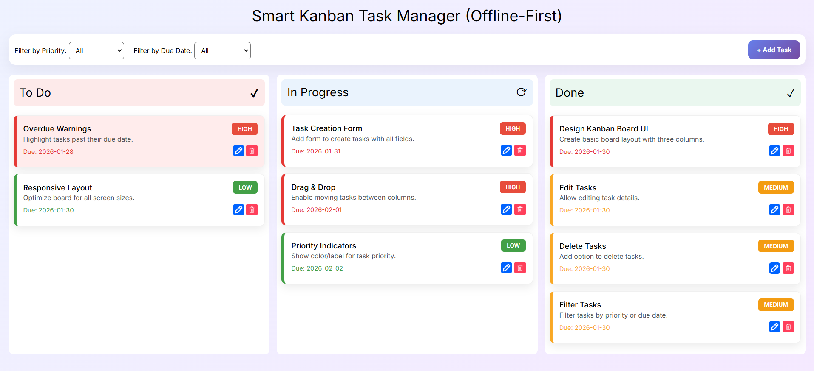
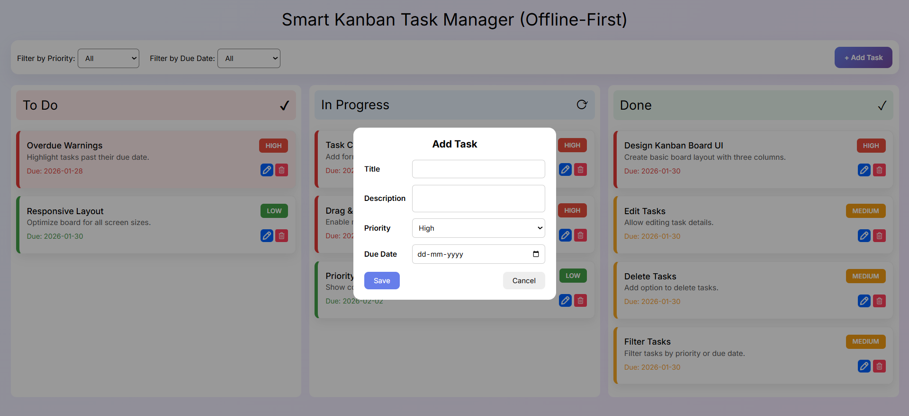
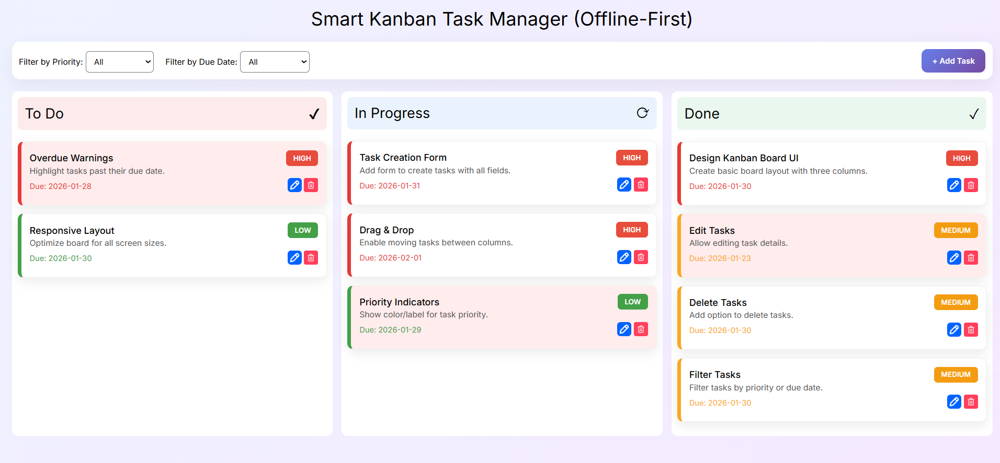

# Smart Kanban Task Manager (Offline-First)

A lightweight **Kanban-style task management web application** built using **HTML, CSS, and Vanilla JavaScript**.  
This app works **completely offline**, uses **localStorage for persistence**, and restores the **exact board state** after refresh.

## 📸 Screenshots

### 🧩 Kanban Board Overview

### ➕ Create Task

### 📝 Edit Task

### 🚨 Overdue & Priority Indicators

